# Resultats de demonstration

Ce document presente des exemples concrets d'utilisation des agents du
projet, avec les sorties reelles obtenues.

## Base vectorielle Qdrant

Collection `ansible_docs` peuplee suite a l'indexation de la documentation
Ansible (Phase 4) : 81 points, statut `green`, dimension des vecteurs 384
(distance cosinus).

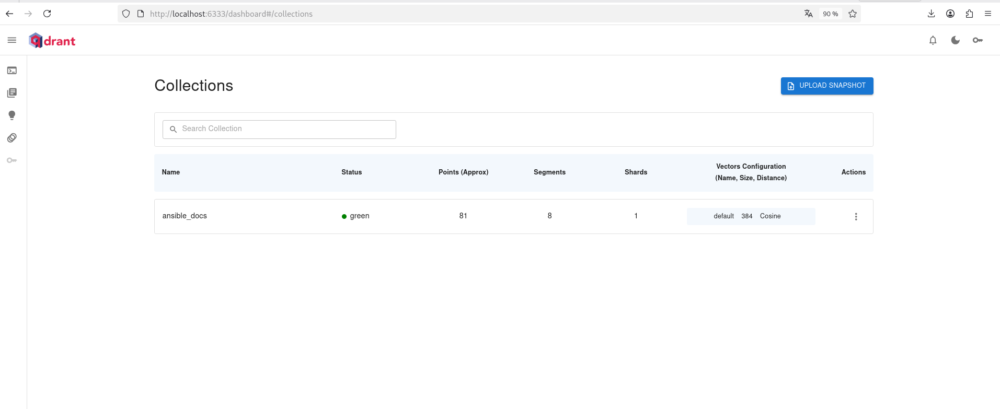

## Agent SQL infrastructure

Trois questions representatives, illustrant la decouverte de schema,
l'execution d'une requete reelle avec agregation, et le test de
connectivite reseau.

```text
(sql_agent) [mohamed@redhat sql_agent]$ python main.py
Assistant infra AIOps Sentinel, pose ta question.

User q/quit, h/history, c/clear $> Quelles tables existent dans la base ?
DEBUG: router decision text:
{"use_tools": true, "tools": ["get_pg_schema"], "reason": "l'utilisateur demande la liste des tables existantes dans la base de donnees"}

function_name:  get_pg_schema
function_params:  {}
Voici les tables existantes dans la base de donnees :

- **incidents**
- **servers**
- **services**

*(Ces tables sont dans le schema `public` du schema `aiops_sentinel`.)*
User q/quit, h/history, c/clear $> Combien d'incidents sont actuellement ouverts ?
DEBUG: router decision text:
{"use_tools": true, "tools": ["execute_sql_query"], "reason": "la question porte sur le nombre d'incidents ouverts, ce qui necessite une requete a la base de donnees"}

function_name:  execute_sql_query
function_params:  {'query': "SELECT COUNT(*) AS open_incidents_count FROM incidents WHERE status != 'resolved';"}
```sql
SELECT COUNT(*) AS open_incidents_count
FROM incidents
WHERE status != 'resolved';
```

**Resultat :**
Il y a actuellement **2 incidents ouverts** (non resolus).
User q/quit, h/history, c/clear $> Est-ce que le serveur 127.0.0.1 sur le port 5432 est joignable ?
DEBUG: router decision text:
{"use_tools": true, "tools": ["check_server_reachability"], "reason": "l'utilisateur demande si un serveur est joignable sur un port specifique"}

function_name:  check_server_reachability
function_params:  {'host': '127.0.0.1', 'port': 5432}
Le serveur **127.0.0.1** sur le port **5432** est **joignable**.
```

## Agent RAG documentation

Deux questions sur des sujets distincts de la documentation Ansible
indexee, illustrant la recherche semantique et la citation systematique
des sources. Les reponses completes etant longues et detaillees, seuls le
debut et la conclusion (sources) sont conserves ici ; le contenu integral
est visible en execution reelle de l'agent.

```text
(rag_agent) [mohamed@redhat rag_agent]$ python main.py
Assistant documentation Ansible (RAG), pose ta question.

User q/quit, h/history, c/clear $> Comment fonctionne un playbook Ansible ?
Un **playbook Ansible** est un fichier YAML qui definit une serie d'**etapes (plays)** a executer sur un ou plusieurs hotes cibles. Voici comment il fonctionne, selon les extraits fournis :

### 1. Structure de base d'un playbook
Un playbook est compose d'une ou plusieurs **plays**, chacune definissant :
- `hosts` : Les hotes ou groupes d'hotes sur lesquels la play s'execute
- `tasks` : Une liste de taches (modules Ansible) a executer
- `vars` (optionnel) : Variables specifiques a la play

[...]

### Sources
- Ansible playbooks — Ansible Community Documentation
  https://docs.ansible.com/ansible/latest/playbook_guide/playbooks_intro.html
- Using variables — Ansible Community Documentation
  https://docs.ansible.com/ansible/latest/playbook_guide/playbooks_variables.html

User q/quit, h/history, c/clear $> Comment fonctionne un module Ansible ?
D'apres les extraits fournis, un **module Ansible** est une unite de code discrete qui permet d'effectuer des taches specifiques sur les hotes distants.

### 1. Definition et role
- Un module est une **tache reutilisable**, appelable en ligne de commande ou dans un playbook
- Il est execute **sur l'hote distant** (pas sur la machine de controle)
- Il retourne des **valeurs de retour** collectees par Ansible

[...]

### Sources
- Introduction to modules — Ansible Community Documentation
  https://docs.ansible.com/projects/ansible/latest/module_plugin_guide/modules_intro.html
- Indexes of all modules and plugins
  https://docs.ansible.com/projects/ansible/latest/collections/all_plugins.html#all-modules-and-plugins
```

## Orchestration multi-agents (Phase 5)

Deux serveurs MCP independants exposent les outils des agents SQL et RAG.
Un orchestrateur route chaque question vers le ou les serveurs pertinents,
via une decision prise par le modele de langage.

### Serveur MCP SQL (port 8001)

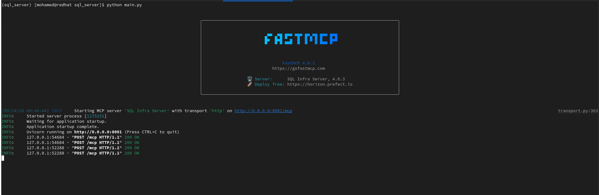

```text
(sql_server) [mohamed@redhat sql_server]$ python test_client.py
Outils disponibles :
- check_server_reachability: Check whether a TCP port on a given host is reachable.
- get_pg_schema: Get PostgreSQL schema for all databases (tables and columns).
- execute_sql_query: Execute a read-only SQL SELECT query against the infrastructure database.
```

### Serveur MCP RAG (port 8002)

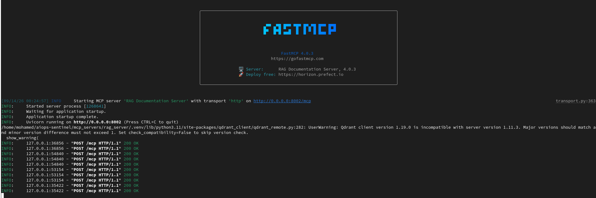

```text
(rag_server) [mohamed@redhat rag_server]$ python test_client.py
Outils disponibles :
- search_ansible_docs: Search the Ansible documentation for passages relevant to the query.
```

### Orchestrateur : question mixte (SQL + RAG combines)

```text
User q/quit $> Le serveur db-prod-01 existe-t-il, et comment fonctionne un module Ansible ?
DEBUG: routing decision:
{"agents": ["sql_agent", "rag_agent"], "reason": "question involves both checking server existence and Ansible module functionality"}

### Inventaire infrastructure
[...reponse basee sur l'inventaire PostgreSQL...]

### Documentation Ansible
[...reponse basee sur la documentation indexee, avec citation des sources...]
```

### Orchestrateur : correction automatique d'une hypothese erronee

Illustration du raisonnement en plusieurs etapes lorsque le modele
verifie les valeurs reelles stockees avant de conclure :

```text
User q/quit $> Combien de serveurs sont en statut actif ?

function_name: execute_sql_query
function_params: {'query': 'SELECT DISTINCT status FROM servers;'}
function_result: [{"status": "active"}, {"status": "maintenance"}]

function_name: execute_sql_query
function_params: {'query': "SELECT COUNT(*) AS active_servers_count FROM servers WHERE status = 'active';"}
function_result: [{"active_servers_count": 4}]

Il y a 4 serveurs actuellement en statut actif.
```

## API Gateway (Phase 6)

Une API FastAPI expose l'inventaire d'infrastructure via un CRUD complet,
et un endpoint conversationnel qui reutilise l'orchestration multi-agents
de la Phase 5. Documentation interactive generee automatiquement (Swagger).

### Documentation interactive (Swagger)

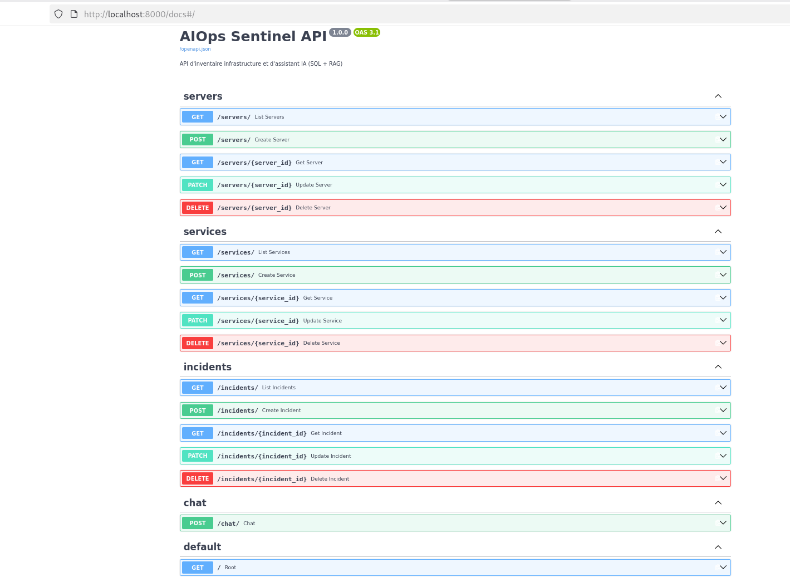

### Endpoint CRUD : liste des serveurs

```text
GET http://localhost:8000/servers/

200 OK
[
  {"id": 1, "name": "web-prod-01", "ip_address": "10.0.1.10", "os": "Ubuntu 22.04", "role": "web", "status": "active", "created_at": "2026-09-11T16:49:04.315255"},
  {"id": 2, "name": "web-prod-02", ...},
  {"id": 3, "name": "db-prod-01", ...},
  {"id": 4, "name": "monitoring-01", ...},
  {"id": 5, "name": "backup-01", "status": "maintenance", ...}
]
```

### Endpoint chat : question sur l'inventaire, via HTTP

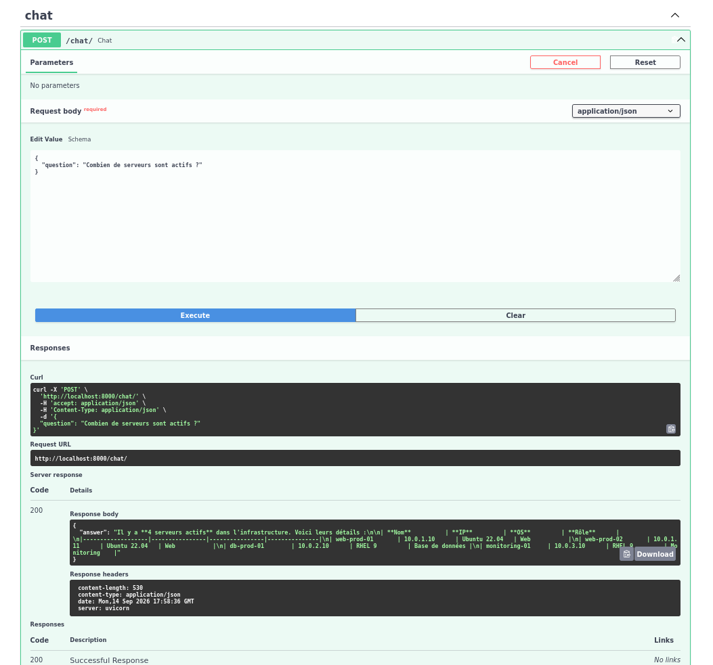

```text
POST http://localhost:8000/chat/
Content-Type: application/json

{"question": "Combien de serveurs sont actifs ?"}

200 OK
{
  "answer": "Il y a 4 serveurs actifs dans l'infrastructure. Voici leurs details :\n\n| Nom | IP | OS | Role |\n|-----|-----|-----|-----|\n| web-prod-01 | 10.0.1.10 | Ubuntu 22.04 | Web |\n| web-prod-02 | 10.0.1.11 | Ubuntu 22.04 | Web |\n| db-prod-01 | 10.0.2.10 | RHEL 9 | Base de donnees |\n| monitoring-01 | 10.0.3.10 | RHEL 9 | Monitoring |"
}
```

## Observabilite Splunk (Phase 7)

Chaque service du projet (agents, orchestrateur, API) envoie desormais ses
evenements cles vers Splunk via HEC : decisions de routage, appels d'outils,
recherches semantiques, et reponses finales, consultables et filtrables
depuis une interface unique.

### Logs de l'Agent SQL

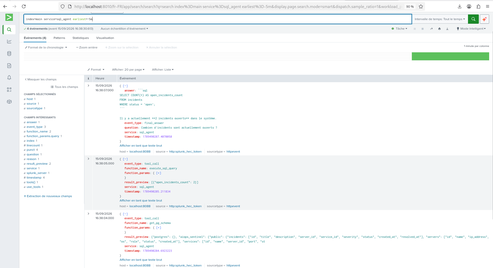

### Logs de l'Agent RAG

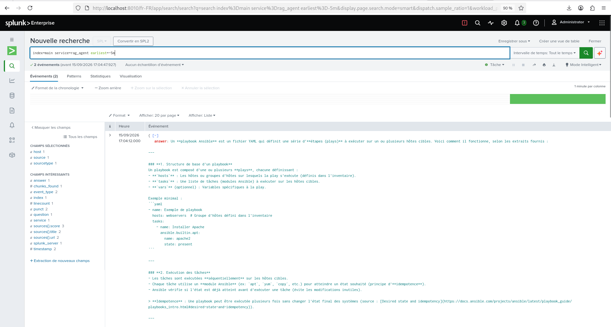

### Logs de l'orchestrateur MCP

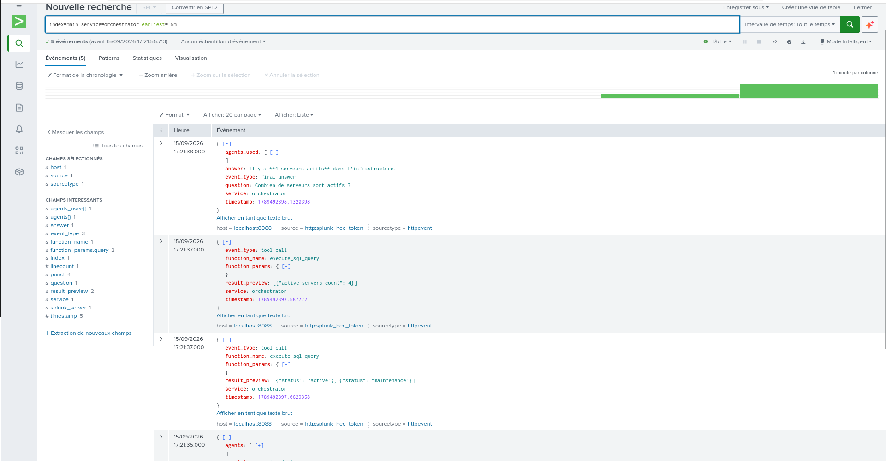

### Logs de l'API Gateway (endpoint /chat)

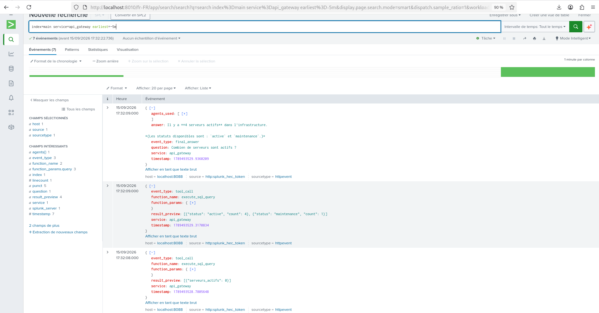

### Test de l'endpoint /chat avec observabilite active

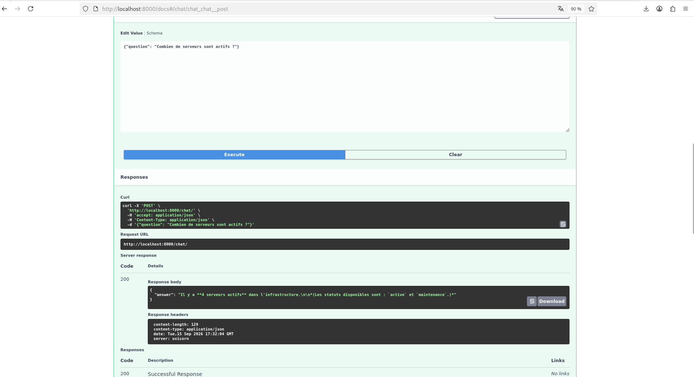

## Deploiement Kubernetes (Phase 8)

L'ensemble de l'architecture applicative (PostgreSQL, Qdrant, serveurs MCP
SQL et RAG, API Gateway) tourne desormais dans un cluster Kubernetes (k3s),
accessible via un point d'entree unique (HAProxy), sans tunnel temporaire.

### Etat des pods dans le cluster

```text
NAME                           READY   STATUS    RESTARTS   AGE
api-gateway-68b6664d98-mfmph   1/1     Running   0          7h37m
haproxy-7df8d899c-hxj78        1/1     Running   0          7h4m
postgres-688b48df8f-t9s9m      1/1     Running   0          23h
qdrant-7b8457bb94-plwj5        1/1     Running   0          23h
rag-server-d5cc5f756-m52wh     1/1     Running   0          8h
sql-server-58b89d5887-hrqb8    1/1     Running   0          22h
```

### Documentation Swagger, accessible via HAProxy

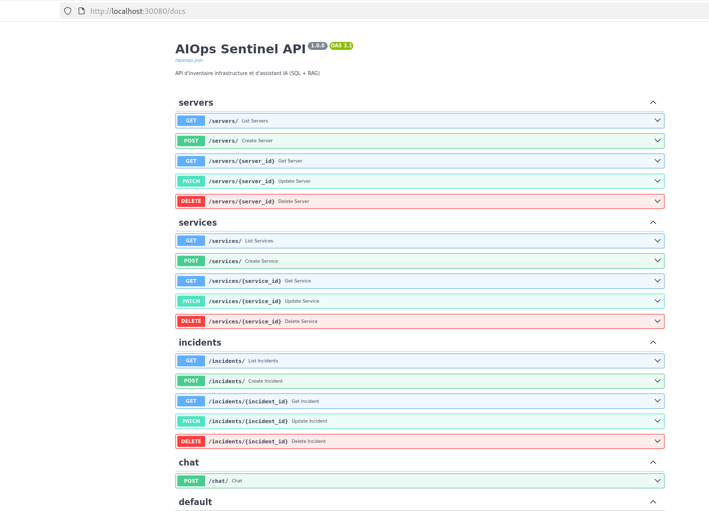

### Endpoint chat, teste via HAProxy (sans tunnel)

```text
POST http://localhost:30080/chat/
Content-Type: application/json

{"question": "Combien de serveurs sont actifs ?"}
```

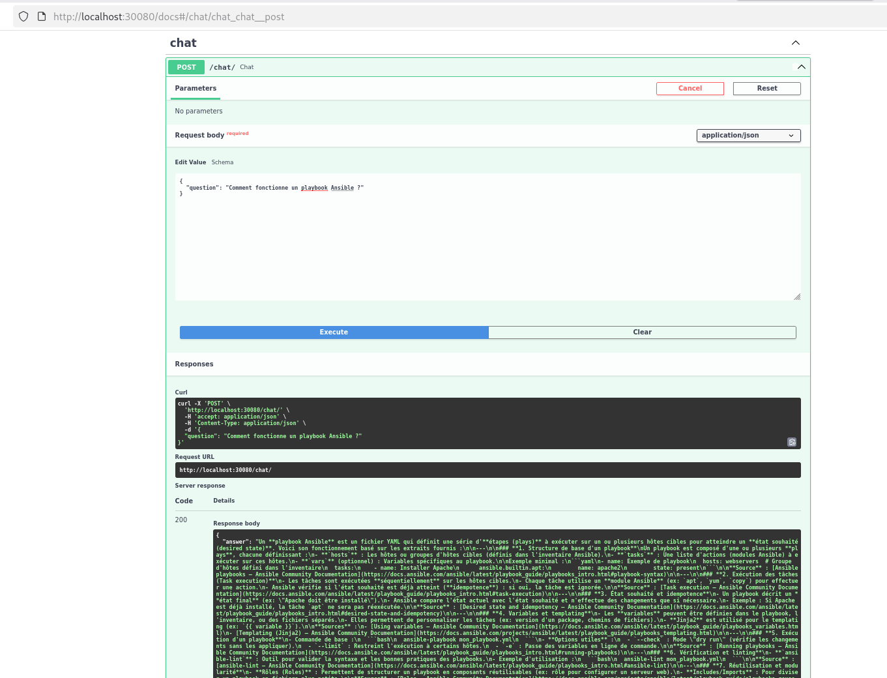

## LLM Serving local avec llama.cpp (Phase 7, partie 2)

Un moteur d'inference LLM local (llama.cpp, modele Qwen2.5-1.5B-Instruct)
est deploye dans le cluster Kubernetes et expose via HAProxy sous le
prefixe `/llm`, en complement du fournisseur externe (Mistral AI).

### Test de sante et d'inference via HAProxy

````text
$ curl -4 -s http://localhost:30080/llm/health
{"status":"ok"}

$ curl -4 -s http://localhost:30080/llm/v1/chat/completions \
  -H "Content-Type: application/json" \
  -d '{"model": "qwen2.5-1.5b", "messages": [{"role": "user", "content": "Bonjour, reponds en une phrase : qu est-ce que Kubernetes ?"}]}'

{"choices":[{"finish_reason":"stop","index":0,"message":{"role":"assistant","content":"Kubernetes est un orchestration de conteneurs qui permet la gestion efficiente de multiples instances de conteneurs."}}], ...}
````

### Agent SQL connecte a llama-server

````text
(sql_agent_llama) [mohamed@redhat sql_agent_llama]$ python3 main.py
Assistant infra AIOps Sentinel, pose ta question.

User q/quit, h/history, c/clear $> Montre-moi la liste des serveurs enregistres

```sql
SELECT * FROM servers;
```
````

### Agent RAG connecte a llama-server

````text
(rag_agent_llama) [mohamed@redhat rag_agent_llama]$ python3 main.py
Assistant documentation Ansible (RAG), pose ta question.

User q/quit, h/history, c/clear $> Comment fonctionne un playbook Ansible ?

Un playbook Ansible est un fichier texte qui contient une serie de commandes pour executer des taches sur un systeme. Voici les etapes principales pour executer un playbook Ansible :

1. **Templating (Jinja2)**: Les variables dans les taches sont definies en utilisant une syntaxe templee, generalement basee sur Jinja2.

2. **Tests**: Les taches peuvent inclure des tests pour verifier la conformite des variables ou des valeurs.

[...]

En utilisant ces elements, un playbook Ansible peut executer une serie de taches sur un systeme distant, en fonction d'une structure definie dans le playbook.
````
